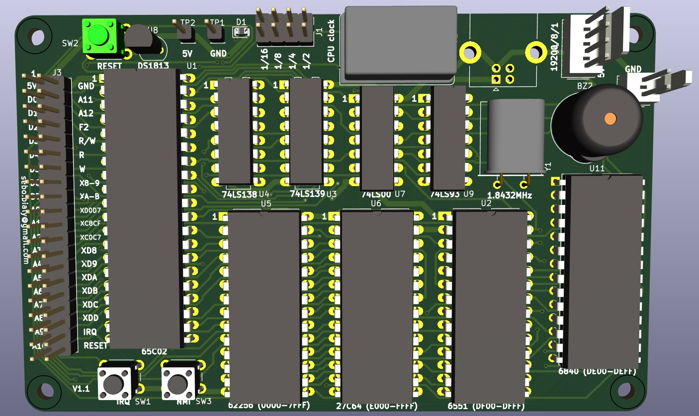

# 6502_computer
Simple 6502 DIY computer for peripheral prototyping

**This is a work in progress. Do not try to manufacture yet.**
# Features
1. 65C02 with selectable speed
2. 6551 UART/ACIA with optional USB support via CH340N
3. 6840 clock chip (with buzzer attached)
4. CPU bus accessible, with several selection signals for various parts of memory
5. SyMon III directly working through UART/USB
6. Simple emulator
7. PCB with all possible markings, memory map, and values
8. Compact form, retro look&feel
